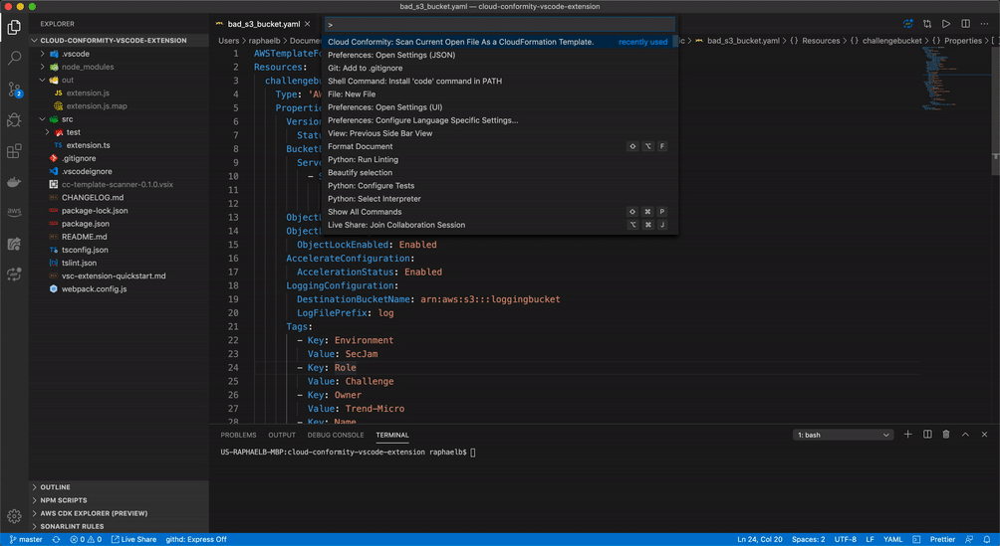

# Cloud One Conformity VSCode Extension

This is a extension with a simple implementation of Cloud One Conformity template scanner right from the IDE.

## Features

This extension has a really simple feature: a preventative measure to ensure your AWS infrastructure remains compliant by detecting risks in template files before they are launched into AWS.

More info about the scanner over [here](https://github.com/cloudconformity/documentation-api/blob/master/TemplateScanner.md).

## Requirements

You ***need*** to configure your API Key and you ***might*** need to configure the endpoint region, as it defaults to us-west-2.  To do so, see the Extension Settings below:

## Extension Settings

This extension contributes the following settings:

* `cc.apikey`: a string with your Cloud Conformity apikey
* `cc.region`: Defaults to `us-west-2`. Change it to your Cloud Conformity used endpoint. 
* `cc.output`: Defaults to `tab`. Valid options are `tab`, `table`, `json` or `csv`. 
* `cc.defaultAccountId`: Optional. Dafaults to null. Set a default AccountID if you don't want to use the dafault.
* `cc.defaultProfileId`: Optional. Dafaults to null. Set a default ProfileID if you don't want to use the dafault.

If you need help on how to edit these settings, you can find more info [here](https://code.visualstudio.com/docs/getstarted/settings).

## How to Use It?

First, open VS Code Command Palette (⇧⌘P on Mac or Ctrl+⇧+P on Windows). Then:

1 - You can scan the current open file through:
> "Cloud One Conformity: Scan Current Open Template."

2 - You can scan any other template right-clicking the file and selecting:
> "Cloud One Conformity: Scan Selected Template."

#### Atention Serverless Framework Users!
>If you are using the extension to scan Serverless Framework templates, make sure to package your application before running the scan. This capability is only available to AWS applications.

## Known Issues

None. Please, open an issue if you find one!

## Contribute

Pull Requests are encouraged!

## Release Notes

### 0.6.2
 - Added logging for troubleshooting.

### 0.6.1
 - Fix to support Windows for Terraform scanning.

### 0.6.0
 - Added support for Terraform templates.

### 0.5.2
 - Adding support to newer rules.

### 0.5.1
 - Adding support to newer rules.

### 0.5.0
 - Using Actions to automatically update the Extension whenever new rules are made available.
 - Fixed a bug that the Knowledge Base url was broken for certain services.

### 0.4.0
 - Support to scan templates against Account and Profile configurations.

### 0.3.1
 - Typos and branding corrections.

### 0.3.0
 - "New Tab" output format supported and used by default. This allows for greater visibility of the findings, but also links the detections back to the Conformity Knowledge Base.

### 0.2.0
 - Serverless Framework for AWS projects support.

### 0.1.3
 - Proper message if the template is clean
 - Order the detections by risk level.

### 0.1.2
- Bug fixes

### 0.1.1

- Adding an icon to the extension.
- Better README.md

### 0.1.0

- First public release
